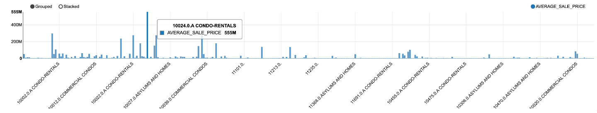
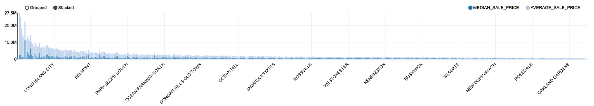
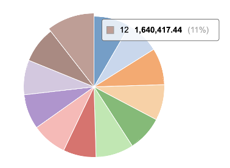
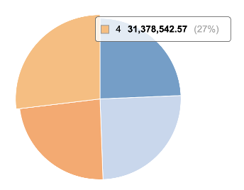
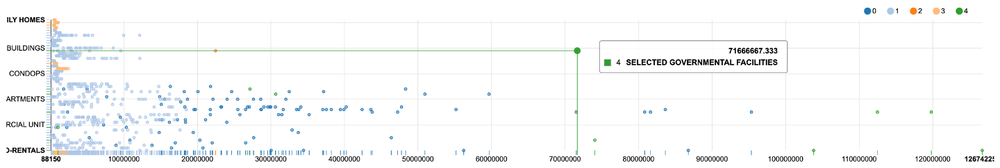
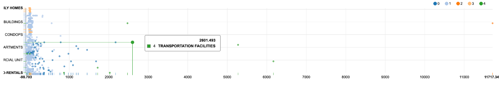

# Real Estate Data Analytics

This repository contains my project work for the [CSCI-GA.2437](https://cs.nyu.edu/courses/fall24/CSCI-GA.2437-001) **Big Data Application Development** course at NYU.

## Project Overview
This project involves the analysis of a large NYC real estate dataset using Apache Spark, Scala, and Zeppelin Notebook. The goal was to clean and transform the data, perform clustering to segment properties, and analyze spatial and temporal patterns to uncover insights into market trends and neighborhood dynamics.

## Tech Stack
- HDFS
- Apache Spark (MapReduce)
- Apache Zeppelin
- Scala

## Structure
- `data/`: small pieces of dataset for preview
- `figures/`: visualizations created with Apache Zeppelin / Python Pandas
- `code.ipynb`: zeppelin notebook for data exploration and modeling
- `slides.pdf`: our presentation slides
- `report.pdf`: our final report

## Analytics:
- **Utilized Apache Spark, Scala, and Zeppelin Notebook** to process and analyze a large NYC real estate dataset, implementing scalable workflows for data cleaning and transformation.
- Built a **KMeans clustering** pipeline with dimensionality reduction to segment properties into distinct clusters.
- Calculated growth rates and analyzed spatial and temporal patterns to uncover insights into seasonal market behaviors and neighborhood dynamics.
- Visualized results with **Zeppelin** and **Pandas Matplotlib**: bar charts for sale prices, scatter plots for clustering, and pie charts for transaction volumes to highlight trends.

## Overview
Below are some selected results showcasing the figures generated during the analysis.

### Bar Chart: Sale Prices by Category

### Bar Chart: Sale Prices by Neighborhood

### Growth Analysis: Temporal Patterns

### Scatter Plot: KMeans Clustering Results

